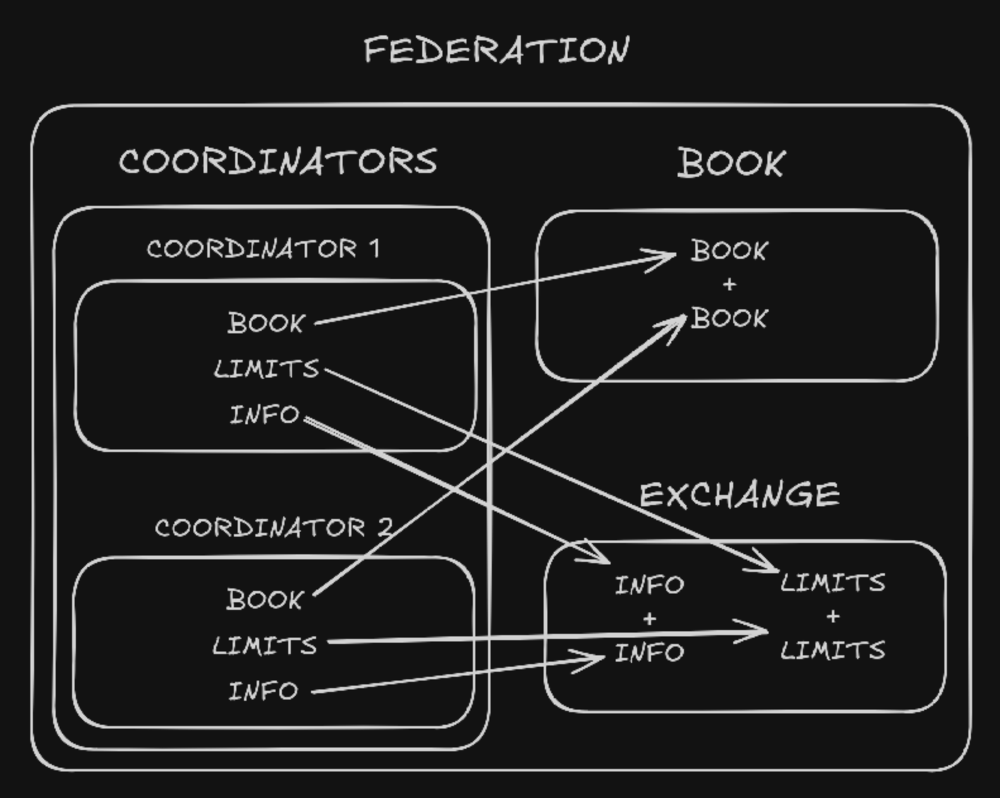

# Documentation

## Client

### Garage

The `Garage` contains user's tokens separated by `Slots`. Every `Slot` stores the core data generated with the token and a set of `Robots`. Tokens should always be sent to all coordinators upon creation or recovery to ensure consistency and a good user experience.

<div align="center">
  
</div>

### Federation

The `Federation` stores information from all available coordinators. All coordinators information is aggregated here: `book` for all orders and `exchange` for `Coordinator`'s meta data. When the Nostr connection is active, `book` is filled with orders from relays instead.

<div align="center">
  
</div>

### Coordinator

A `Coordinator` contains the main data obtained from its primary API endpoints: `/api/book`, `/api/limits` and `/api/info`, and provides functions for any necessary API calls related to this matter. It also stores some static data loaded from [federation.json](/frontend/static/federation.json).

<div align="center">
  
</div>

### Robot

A `Robot` fetches the information that a specific `Coordinator` has about a token and all necessary functions to interact with it.

<div align="center">
  
</div>

### Order

An `Order` contains the details obtained from the coordinator hosting it and all necessary functions to interact with it. The client also has the concept of `MakerForm`, which is none other than the necessary data for order creation before it is sent to the selected coordinator.

<div align="center">
  
</div>

## Coordinator

A `Coordinator` serves as one of the decentralized backends within the federation, but incorporating all the essential logic to operate in complete isolation. This architecture ensures that there is no interdependence among federation members; however, they utilize an internal Nostr mesh to facilitate the reachability of information to any client.

You can check the entire architecture here https://github.com/RoboSats/robosats-deploy

<div align="center">
  
</div>

### API

The API facilitates all necessary interactions between users and the `Coordinator`, with a particular emphasis on robot and order management.

#### Authentication

To ensure that a `Coordinator` is aware of the existence of a robot and to facilitate further validation of requests, API calls must include the following Authorization header:

```
Token ${tokenSHA256} | Public ${pubKey} | Private ${encPrivKey} | Nostr ${nostrPubkey}
```

- `tokenSHA256`: Base91 encoding of the SHA2-256 hash of a robot token.

- `pubKey`: __DEPRECATED__

- `encPrivKey`: __DEPRECATED__

- `nostrPubkey`: The secp256k1 public key derived from the SHA2-256 hash of a robot token.

#### Robot

#### Order

#### Book

#### Meta

#### Chat

### Workers

### Bitcoin & Lightning

### Nostr relay


