# Wie benutzt man RoboSats (v0.1.0)

RoboSats ist auf Benutzerfreundlichkeit ausgerichtet. Die Plattform ist im Prinzip selbsterklärend, so dass man sagen könnte, ein Tutorial ist wirklich nicht notwendig. Allerdings hilft es wirklich, sich beim Handel wohl zu fühlen, wenn du bereits weißt was die nächsten Schritte sind, so dass dich nichts überrascht. Schließlich sind Bitcoin-P2P-Börsen sehr einschüchternd! Keine Angst, RoboSats hält es wirklich einfach und du kannst einfach nichts falsch machen! :D

Dieses Dokument enthält zwei vollständige Durchgänge:
1) als Käufer, der eine Order annimmt, und
2) als Verkäufer, der eine Order aufgibt.
Da die Plattform dem Benutzer in den Menüs alles genau erklärt, werden wir einige Zeilen einigen Tricks widmen und zwischendurch Tipps für einen sicheren Handel geben.

## Startseite der Benutzergenerierung
RoboSats hilft den Nutzern, ihre Privatsphäre zu schützen, indem bei jedem Handel neu erstellte Avatare verwendet werden. Avatare sind super einfach zu erstellen!

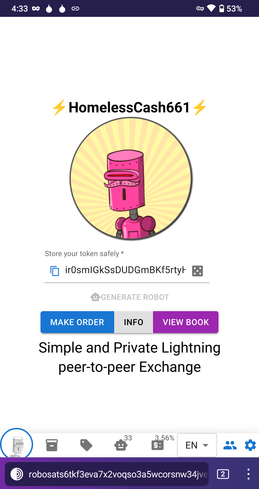

RoboSats begrüßt dich sofort mit deinem einzigartigen Roboter-Avatar. Der Roboter wird auf der Grundlage des Tokens, den du unter ihm siehst, deterministisch generiert. Dieser Token ist alles, was du brauchst, um den Avatar in der Zukunft wiederherzustellen, also achte darauf, ihn **sicher zu sichern!**

Die Token werden in deinem eigenen Browser generiert. Wenn du jedoch der Zufälligkeit deines Rechners nicht traust, kannst du auch deinen eigenen Entropie-Token eingeben. *Beachte, dass Token mit geringer Entropie nicht gültig sind.

Ich war wirklich nicht glücklich darüber, "HomelessCash" zu sein :D Also klicke ich einfach auf das Würfelsymbol, um einen neuen Token zu generieren, und tippe auf "Avatar generieren", um einen neuen zu bekommen.
 

Ah, "JoyfulPain", so viel besser!! :) 
Der Token bleibt einige Zeit im Speicher deines Browsers, du kannst ihn also später noch kopieren, indem du auf das Profilsymbol in der unteren linken Ecke tippst. Allerdings vergisst dein Browser dein Token, wenn du ihn aktualisierst oder schließt!  
 

Am besten ist es, ihn auf Papier aufzuschreiben...  aber das ist eine Menge Arbeit!! Meistens reicht es aus, ihn einfach in die Zwischenablage zu kopieren und woanders zu speichern. **Wenn dein Browser abstürzt, der Akku deines Handys leer ist oder du während des Handels die Verbindung verlierst, brauchst du den Token, um dich wieder einzuloggen und den Handel fortzusetzen!**

### Wiederherstellen eines Roboters
Um einen gesicherten Token wiederherzustellen, ersetze den Token einfach im Textfeld und tippe auf "Roboter generieren". Die Website begrüßt dich mit "We found your Robot avatar. Welcome back!"

## Handeln

In RoboSats kannst du neue Angebote (Order) machen oder Angebote von anderen annehmen. Um ein _Aungebotssersteller_ zu sein, klick einfach auf "Create Order" auf der Homepage. Um ein Angebot anzunehmen, klicke auf "Buch ansehen", damit du die von anderen Robotern erstellten Angebote sehen kannst.

### Erkunden des Orderbuches

Wir klicken auf "View book" und sehen uns die Angebote auf der Orderbuch Seite an.

In einem Desktop-Browser siehst du auf einen Blick alle wichtigen Informationen zu den Angeboten, so dass du entscheiden kannst, welchen du annehmen möchtest. Standardmäßig zeigt das Buch "JEDE" Art von Angeboten (Buy / Sell) und "JEDE" Währung an. Verwende die Dropdown-Menüs am oberen Rand, um deine Präferenzen auszuwählen.

Auf einem Smartphone passen jedoch nicht alle Spalten auf den Bildschirm. Die Spitznamen, die Art des Angebotes, die Zahlungsmethode und der Wechselkurs sind standardmäßig ausgeblendet. Du kannst auf eine beliebige Spalte und dann auf "Spalten anzeigen" tippen, um auszuwählen, welche Spalten sichtbar sein sollen.

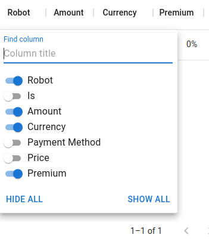

Ein weiterer Trick ist ein langes Tippen oder Wischen:
 - Auf Avatar: Du erhältst Nickname und Aktivitätsstatus.
 - Auf Betrag: Du erfährst, ob der Ersteller ein Verkäufer (Seller) oder ein Käufer (Buyer) ist.
 - Auf Währung: Du erhältst die bevorzugte Zahlungsmethode.
 - Auf Prämie: Du erhältst den aktuellen Wechselkurs.
Beispiel für langes Tippen/Wischen über die Währung:

Beispiel für langes Tippen/Wischen oberhalb der Prämie:

Du kannst auch auf einen beliebiges Angebot tippen, um die komplette Angebotsseite zu sehen:

Jedes Angebot hat einen Verfallszähler. In RoboSats v0.1.0 bleiben neue Angebote standardmäßig 24 Stunden lang öffentlich im Buch.

### Beispiel-1: Ein Angebot als Käufer annehmen

Wenn du dich für ein Angebot entschieden hast, tippe einfach auf die Schaltfläche "Take Order". Du siehst dann die Kontraktbox. Folge den Anweisungen der Kontraktbox, bis du den Handel abgeschlossen hast! :) 

Als erstes musst du eine kleine Kaution hinterlegen (nur 1% des Handelsbetrags), damit der Verkäufer weiß, dass du vertrauenswürdig bist. Die Satoshis in dieser Kaution werden einfach in deiner Wallet eingefroren. Wenn du versuchst zu betrügen oder einseitig zu kündigen, verlierst du die in der Kaution enthaltenen Satoshis.

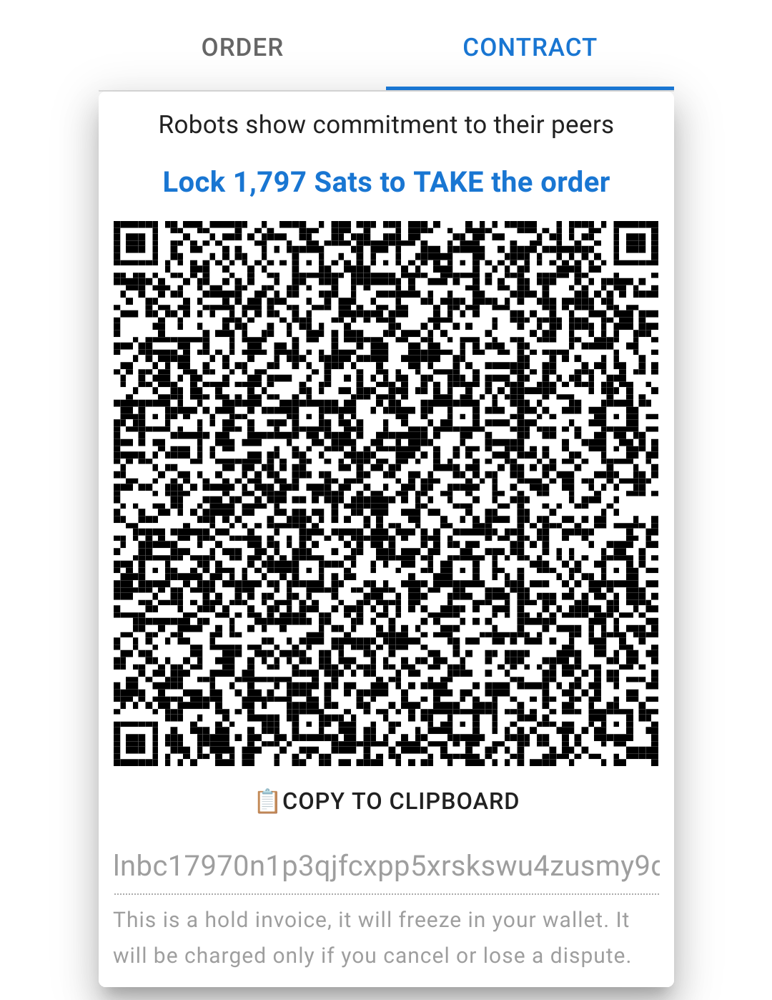

Scanne oder kopiere die Invoice in deine Lightning Wallet. Sie könnte als Zahlung angezeigt werden, die sich auf dem Transportweg befindet, einfrieren oder sogar scheinbar deine Wallet zerstören. Du solltest immer auf der RoboSats-Website überprüfen, ob die Kaution gesperrt wurde (deine Wallet wird dir das wahrscheinlich nicht sagen! Siehe [kompatible wallets](https://github.com/Reckless-Satoshi/robosats/issues/44))

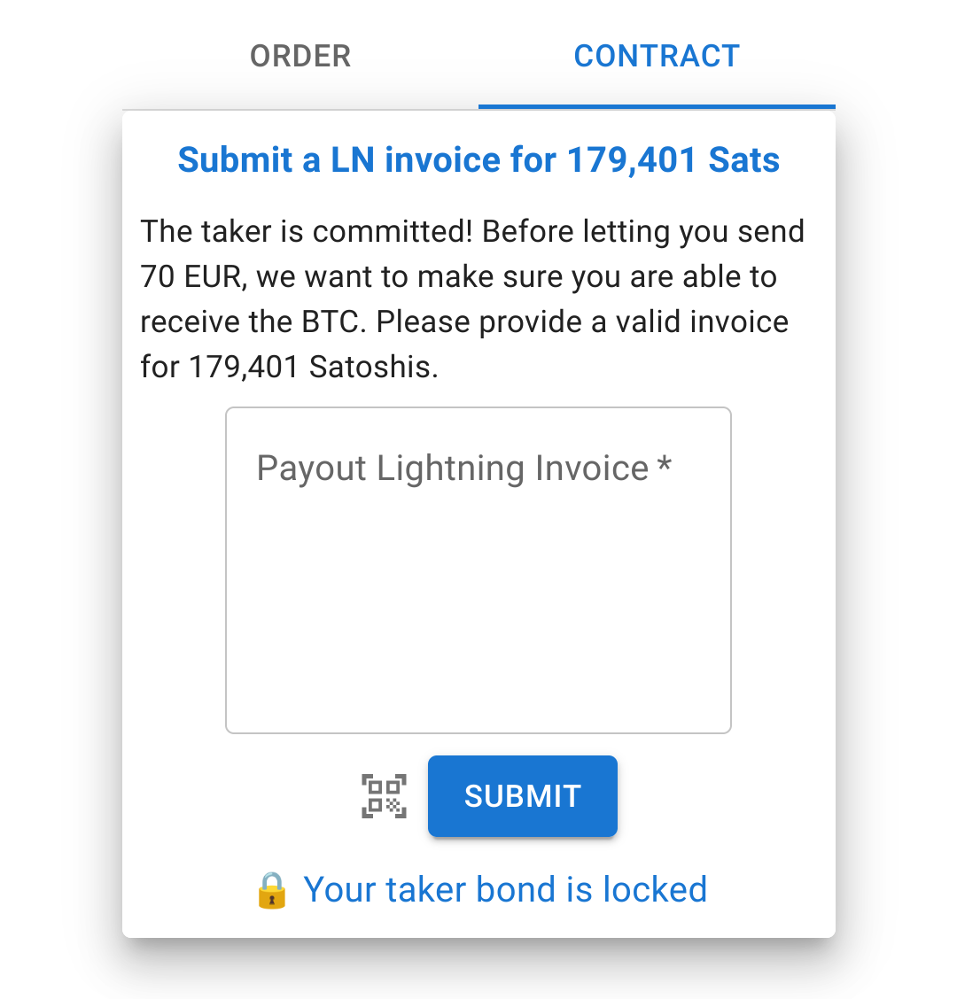

Sobald deine Kaution gesperrt ist, wird RoboSats dich bitten, eine Lightning-Invoice zu erstellen, um dir die Satoshis zu schicken. Erstelle eine Invoice mit dem genauen Betrag in deiner Lightning Wallet und schicke sie ab. 

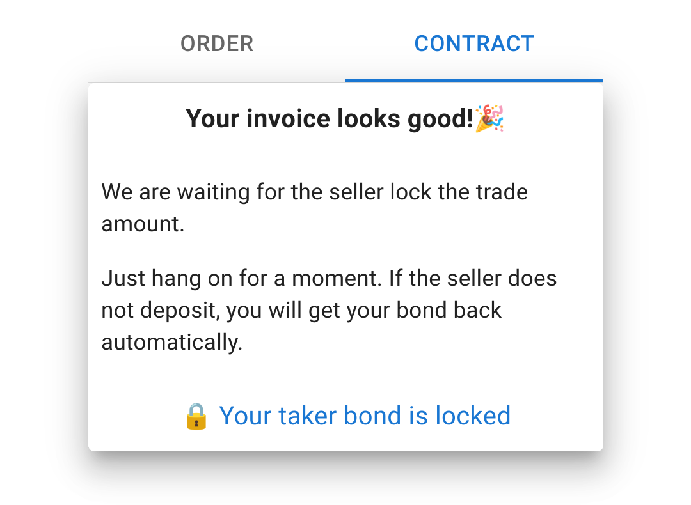

Während du deine Auszahlungsinvoice einreichst, wird der Verkäufer aufgefordert, die Invoice für den Handelskredit zu sperren. Wenn Sie schneller sind als er, müssen Sie warten. Ansonsten können Sie bereits mit ihm chatten. 

Es gibt ein Zeitlimit von 3 Stunden, um die Invoice einzureichen (Käufer) und das Treuhandkonto zu schließen (Verkäufer). Läuft die Zeit ab, verfällt die Bestellung und der Roboter, der sich nicht an die Vertragsverpflichtungen gehalten hat, verliert die Kaution. Dies ist ein Mechanismus, der dazu beiträgt, das Spammen von gefälschten Aufträgen, die Zeitverschwendung der Gegenparteien und das DDOSing des Auftragsbuchs zu verhindern.

Sobald der Verkäufer die Satoshis sperrt, ist es sicher, die Fiat-Währung zu senden! Als Käufer musst du den Verkäufer nach den Details zum senden des Fiats fragen. Gib nur die unbedingt notwendigen Informationen über dich weiter, um deine Privatsphäre nicht zu gefährden. Denkt daran, dass in RoboSats v0.1.0 der Chat ohne Speicher funktioniert, so dass die Unterhaltung verloren geht, wenn ihr den Browser aktualisiert.
 

Es gibt ein Zeitlimit von 24 Stunden, um den Fiat-Austausch abzuschließen. Wenn die Zeit abläuft, wird die Bestellung ablaufen und ein Streitfall wird automatisch eröffnet werden. Um den Ablauf der Bestellung zu vermeiden, **verwenden Sie immer sofortige Fiat-Zahlungsmethoden**. Der Versand von Bargeld per Post ist zum Beispiel langsam und wird in v0.1.0 immer einen Disput auslösen. In Zukunft werden längere Verfallszeiten möglich sein.

Sobald du das Fiat versendet hast, solltest du auf die Schaltfläche "Confirm fiat sent" tippen. Danach muss der Verkäufer bestätigen, dass er die Fiat erhalten hat. Sobald er dies bestätigt, ist der Handel abgeschlossen und du erhältst eine Auszahlung auf dein Lightning Wallet. Du wirst vielleicht sehen, dass "Satoshis an den Käufer gesendet" wird, aber normalerweise geht es so schnell, dass du nur diesen Bildschirm siehst. Viel Spaß mit deinen Satoshis!

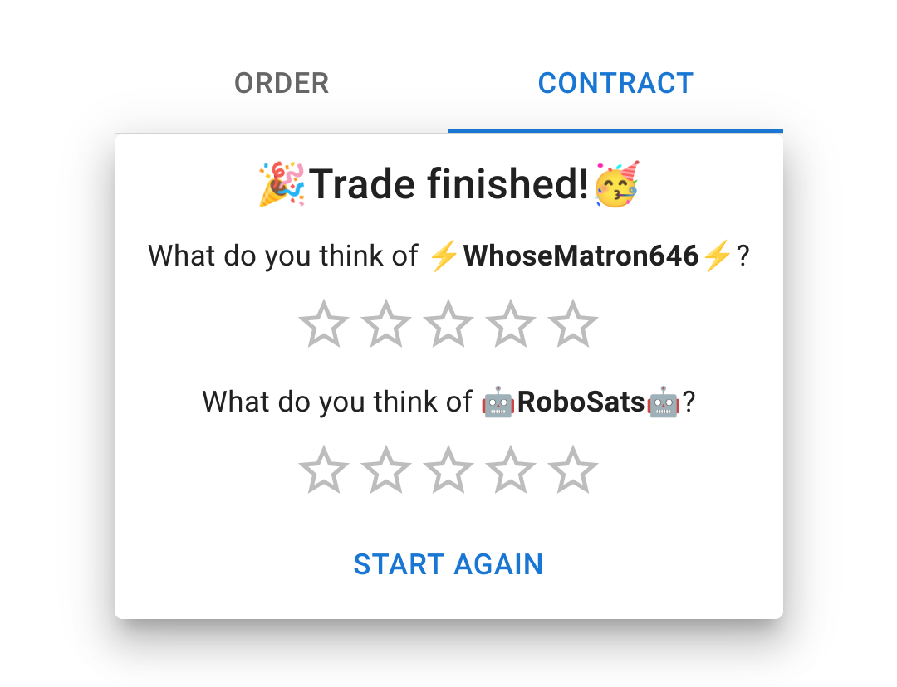

Die Plattform zu bewerten und Tipps zur Verbesserung in unserer Telegram-Gruppe oder Github Issues zu hinterlassen, ist sehr erwünscht!

### Beispiel-2: Ein Angebot als Verkäufer aufgeben

Es kann vorkommen, dass es keine aktiven Angebote für die gewünschte Position und Währung gibt. In diesem Fall gibt es keine Angebote zum VERKAUF von Bitcoin für GBP.
 

Wir können das Angebot genau so erstellen, wie wir es haben wollen. Aber denke daran, dass du ein Angebot veröffentlichen solltest, das die andere auch annehmen wollen! 
 

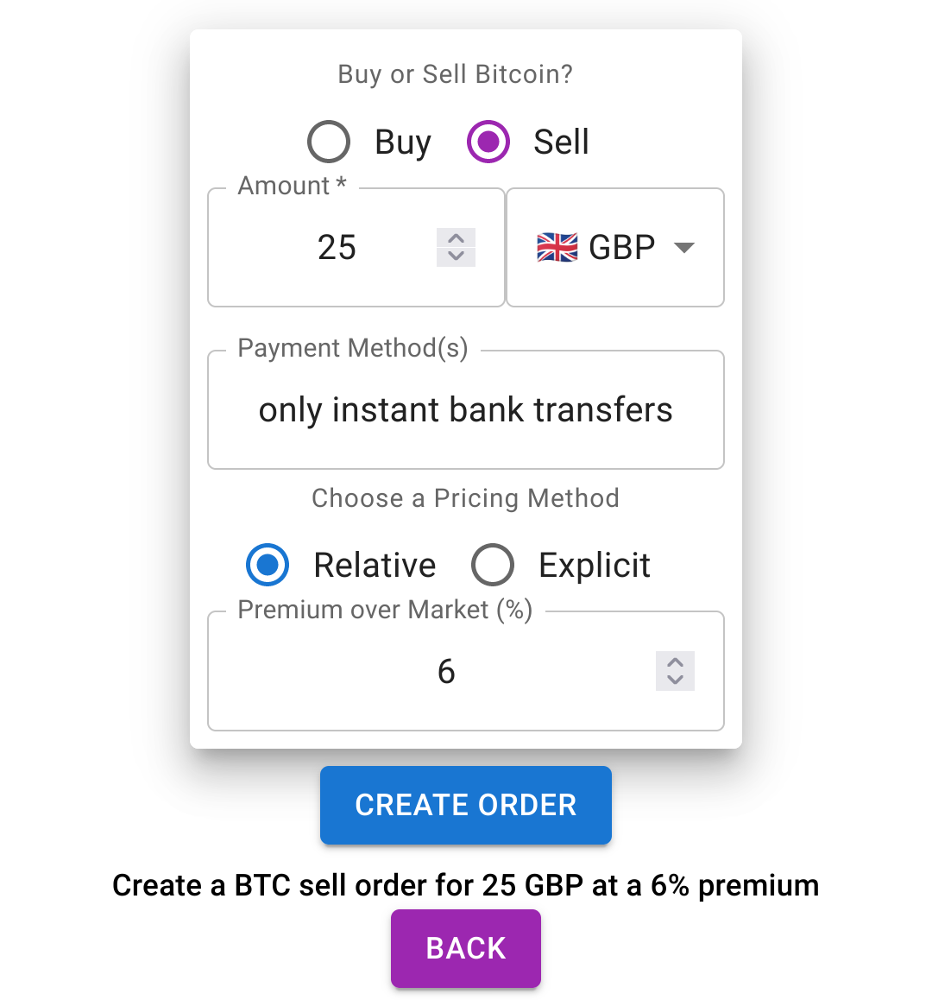

Auf der Maker Seite musst du nur die Währung, die Angebotsart (Kauf/Verkauf) und den Betrag eingeben. Es empfiehlt sich jedoch, die zulässigen Zahlungsarten anzugeben. Es könnte auch hilfreich sein, einen Aufschlag/Rabatt festzulegen, damit dein Angebot schneller angenommen wird. Denke daran, dass du als Verkäufer einen Anreiz für Käufer schaffen kannst, dein Angebot anzunehmen, indem du die Prämie senkst. Wenn es jedoch zu viele Käufer gibt, kannst du die Prämie erhöhen, um einen Handelsgewinn zu erzielen. Alternativ kannst du auch einen festen Betrag an Satoshis festlegen.

*Limits: in Robosats v0.1.0 kann ein Angebot nicht kleiner als 20.000 Satoshis sein ubd es kann nicht größer als 800.000 Satoshis sein, um Fehler beim weiterleiten der Lightning-Zahlung zu vermeiden. Dieses Limit wird in Zukunft erhöht werden.

Du musst die Invoice mit deinem Lightning Wallet kopieren oder scannen, um deine Kaution für den Treuhandgeber zu sperren (nur 1% des Handelsbetrags). Durch das Sperren dieser Kaution wissen die Taker, dass du vertrauenswürdig bist und dich verpflichtest, diesen Handel zu vollenden. In deiner Wallet könnte es als eine Zahlung angezeigt werden, die auf dem Weg ist, einfrieren oder sogar deine Wallet scheinbar zerstören. Du solltest immer auf der RoboSats-Website überprüfen, ob die Kaution gesperrt wurde (deine Wallet wird dir das wahrscheinlich nicht sagen! Siehe [Kompatible Wallets](https://github.com/Reckless-Satoshi/robosats/issues/44))

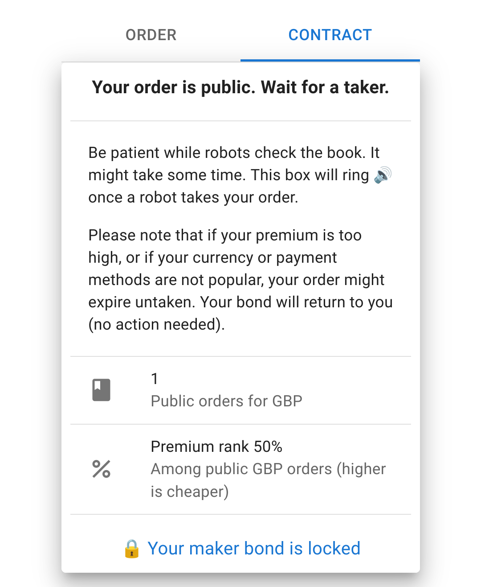

Dein Angebot ist 24 Stunden lang öffentlich zugänglich. Du kannst die verbleibende Zeit bis zum Ablauf überprüfen, indem du die Registerkarte "Order" anklickst. Du kannst das Angebot jederzeit stornieren, bevor es von einem anderen Roboter angenommen wird. Lasse die Registerkarte " Order " offen, um [mit diesem Ton](https://github.com/Reckless-Satoshi/robosats/raw/main/frontend/static/assets/sounds/taker-found.mp3) benachrichtigt zu werden. Am besten ist es, wenn du dies auf einem Desktop-Computer machst und die Lautstärke einstellst, damit du nicht verpasst, wenn dein Auftrag angenommen wird. Das kann lange dauern! Vielleicht vergisst du es sogar! Du kannst auch Telegram-Benachrichtigungen aktivieren, indem du auf "Enable Telegram Notification" und dann im Chat auf "Start" drückst. Du erhältst eine Willkommensnachricht als Bestätigung der aktivierten Benachrichtigungen. Eine weitere Nachricht wird gesendet, sobald ein Abnehmer für dein Angebot gefunden ist.

*Hinweis: Wenn du dein Angebot vergisst und es ein Roboter annimmt und seine Kaution sperrt, riskierst du, deine eigene Kaution zu verlieren, weil du die nächsten Schritte des Handels nicht erfüllst.

Auf der Registerkarte "CONTRACT" kannst du sehen, wie viele andere Angebote für dieselbe Währung öffentlich sind. Du kannst auch sehen, wie gut die eigene Prämie im Vergleich zu allen anderen Angeboten für dieselbe Währung abschneidet.

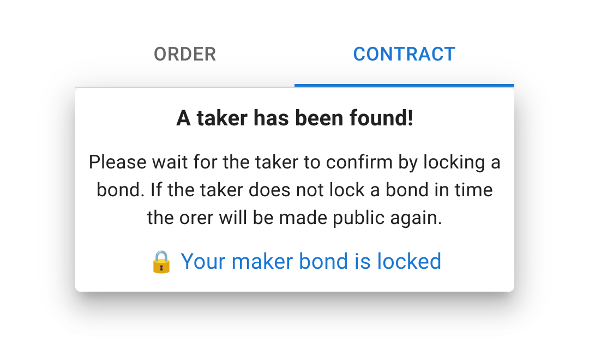

Hurra, jemand hat die Bestellung angenommen! Du hast 4 Minuten Zeit, um eine Treuegarantie für den Taker abzuschließen. Wenn du das nicht tust, wird deine Bestellung automatisch wieder veröffentlicht.

Sobald der Taker die Kaution sperrt, musst du den Handelstreuhand sperren. Dies ist eine Lightning Invoice und wird ebenfalls in deiner Wallet eingefroren. Sie wird erst freigegeben, wenn du bestätigst, dass du die Fiat-Zahlung erhalten hast oder wenn es einen Streit zwischen dir und dem Taker gibt.

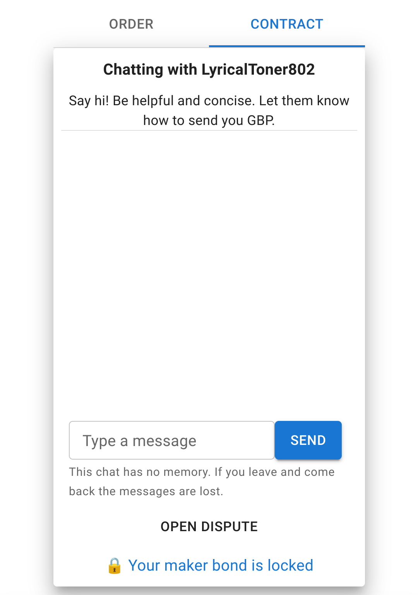

Sobald du das Treuhandkonto sperrst und der Käufer die Auszahlungsinvoice einreicht, ist es sicher, Fiat zu senden! Tausche mit dem Käufer die minimalen Informationen aus, die er braucht, um dir Fiat zu schicken. Denke daran, dass in RoboSats v0.1.0 der Chat keinen Speicher hat und die Unterhaltung verloren geht, wenn du den Browser aktualisierst.

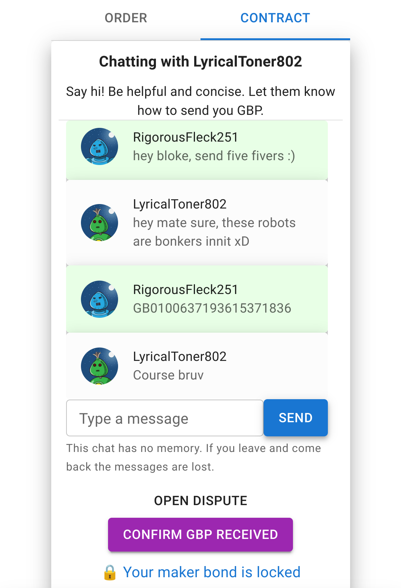

Der Käufer hat gerade bestätigt, dass er seinen Teil getan hat! Überprüfe jetzt, ob das Fiat auf deinem Konto eingegangen ist.

Durch die Bestätigung, dass du das Fiat erhalten hast, wird das Treuhandkonto belastet und an den Käufer gesendet. Mach das also erst, wenn du 100% sicher bist, dass das du das Fiat erhalten hast!

All done!! :D

## Kollaborative Stornierung

Nach der Buchung der Handelskaution und bevor der Käufer bestätigt, dass er das Fiat geschickt hat, ist es möglich, die Order zu stornieren. Es könnte ja sein, dass ihr beide doch keine gemeinsame Methode zum Senden und Empfangen von Fiat habt. Du kannst dich darauf einigen, auf die Schaltfläche " Collaborative cancel " zu tippen. Nachdem der Käufer auf die Schaltfläche "Fiat sent" (Fiat gesendet) geklickt hat, ist die einzige Möglichkeit, einen Handel zu stornieren, die Eröffnung eines Streitfalls und die Einschaltung des Teams. 

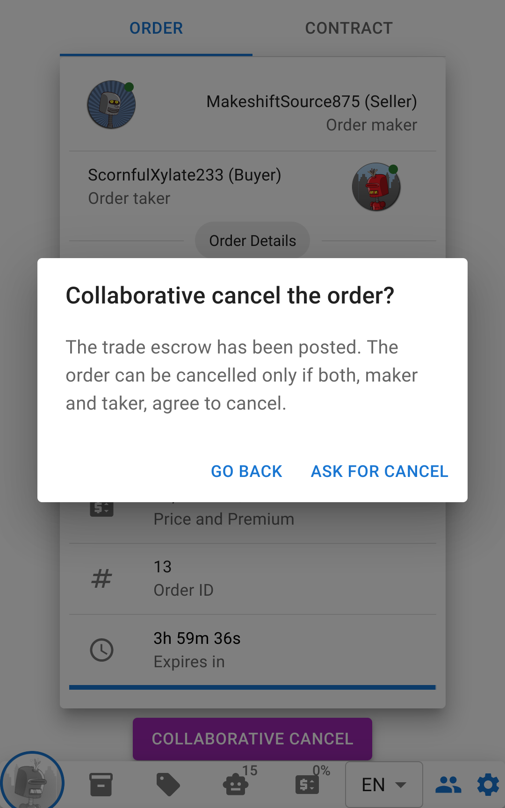

Dies ist absolut nicht empfehlenswert, da einer der beiden Händler seine Kaution verlieren würde, es sei denn, es handelt sich um einen Ausnahmefall (im Ermessen des Teams).

## Rechtsstreitigkeiten

Missverständnisse kommen vor. Es kann aber auch Leute geben, die versuchen, andere zu betrügen. In diesem Fall dachte *MakeshiftSource875*, er käme davon, indem er den Erhalt des Fiats nicht bestätigte und er die Satoshis behalten könnte. 

Dies ist eigentlich nicht möglich, da bei Ablauf der Frist automatisch ein Streitfall eröffnet wird. Wenn du jedoch weißt, dass etwas faul ist, solltest du einen Streitfall eröffnen.

In RoboSats v0.1.0 ist die Streitbeilegungs-Pipeline nicht vollständig im Web implementiert. Daher müssen die meisten Kontakte und Lösungen über alternative Methoden erfolgen. Stelle sicher, dass du eine Kontaktmöglichkeit an die MitarbeiterInnen sendest. Denke daran, dass die Mitarbeiter deinen privaten Chat nicht lesen können, um zu beurteilen, was passiert ist. Es ist sinnvoll, Bilder/Screenshots zu schicken. Um den Datenschutz zu gewährleisten, können diese mit einem PGP-Schlüssel verschlüsselt und in ein beliebiges anonymes Dateifreigabesystem hochgeladen werden.

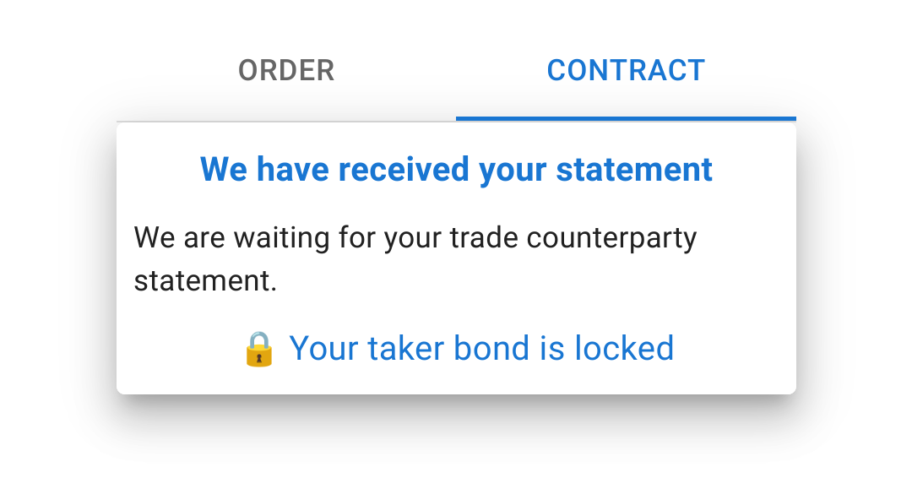

Sobald das Mitarbeiterteam den Streitfall beigelegt hat, wird der endgültige Handelsstatus die Lösung anzeigen. Achte darauf, die Kontaktmethode zu überprüfen, die du den Mitarbeitern angegeben hast. Wenn du einen Streitfall gewonnen hast, wird das Mitarbeiterteam dich erneut um eine Lightning Invoice bitten, um die Auszahlung+Kaution zu senden (deine alte Invoice ist wahrscheinlich abgelaufen!)

