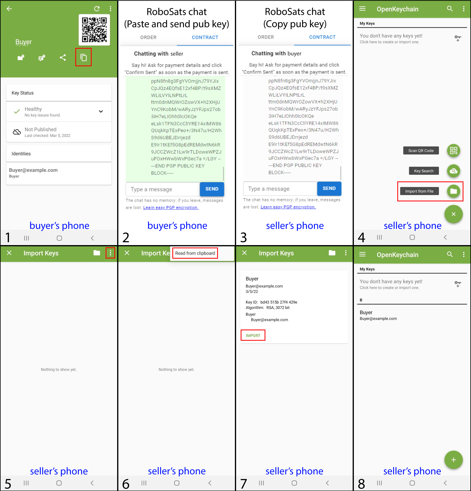
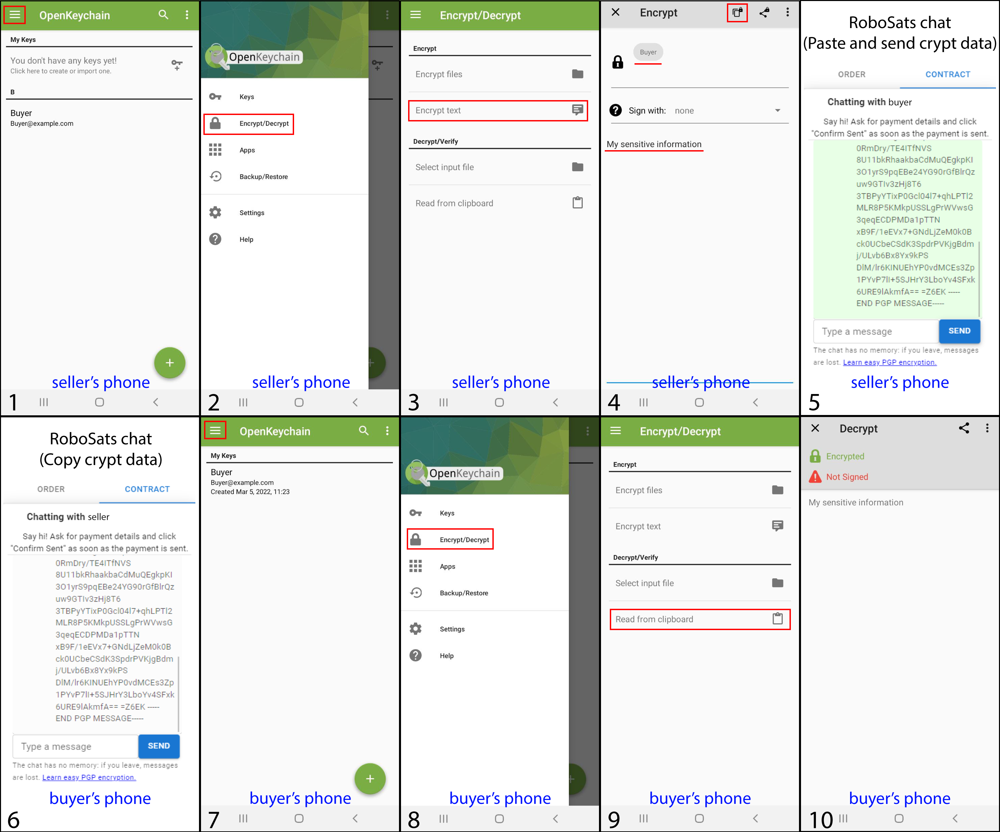

# How to use OpenKeychain for cipher sensible data durning RoboSats trade.

## Why encryption is needed?

Since RoboSats works over tor network, it uses end-to-end encryption, which prevents data in transit from being read or tampered by man in the middle attack at data transport abstraction layer. Also the tor protocol ensures that the user is connected to the domain name in the browser address bar, in this case the official RoboSats tor address(robosats6tkf3eva7x2voqso3a5wcorsnw34jveyxfqi2fu7oyheasid.onion). However, the data is transferred as plain text through the front-end and the back-end of the application. This behavior provides the possibility that sensitive data exchanged regarding fiat payment information could be captured by a malicious sniffer on either party's computer or even on the RoboSats server at application abstraction layer. This action would be an attack to the privacy of the owner of data. A good practice to avoid this problem will be the use of asymmetric encryption during the exchange of sensitive data, this guide shows a method that guarantees sensible data confidentiality using PGP standard.

## OpenKeychain app.

OpenKeychain is an open source Android app that allows to create and manage cryptographic key pairs and sign or/and encrypt/decrypt plain text and files. OpenKeychain is based on the well established OpenPGP standard making encryption compatible across devices and systems. For a list of compatible software for Windows, Mac OS, and other operating systems consult [openpgp.org/software/](openpgp.org/software/). Since the concept is the same, the method can be replicated using another application. OpenKeychain app can be found at F-droid.org [[Link]](https://f-droid.org/packages/org.sufficientlysecure.keychain/) or at Google play store [[Link]](https://play.google.com/store/apps/details?id=org.sufficientlysecure.keychain)

## Encryption schema.

In most cases, the information we would encrypt is the seller fiat payment information, i.e. phone number, PayPal account, etc. So, the image below shows the encryption scheme that ensures that the seller payment information is only read by the buyer.

The data exchange process has been divided into 3 easy steps which are mentioned below:

- Creation of key pairs by the buyer.

- Share the buyer public key with the seller.

- Encrypted data exchange.

## Step by step guide.

### Creation of key pairs by the buyer.

The first step to ensure data confidentiality is to create a public/private key pair. Below are shwon the steps to create a key pair in the OpenKeychain app, this procedure only needs to be done by the buyer. This step only needs to be done once, there is no need to repeat it when buyers want to buy again, since in a future trade he will already have the key pair.

 

 

### Share the buyer public key with the seller.

Now the buyer are in possesion of two keys, the private key must be only known by his owner (in this specific case the buyer, who has also created it) and the public key can be known by anyone else (the seller). OpenKeychain manages the private key, so the buyer does not need the plain text that represents the private key since he doesn't have to share with anyone. Moreover, the seller needs to have the public key in order to encrypt the data, so the buyer must send to seller the plain text that represents the public key. The steps bellow showns how to share the plain text that represents the public key, and how the seller can add it to his OpenKeychain app to use it later.

 

 

The key must be copied including the header (-----BEGIN PGP PUBLIC KEY BLOCK-----) and footer (-----END PGP PUBLIC KEY BLOCK-----) for the correct operation of the application.

### Encrypted data exchange.

Once the seller has the buyer public key, the encryption schema show above can be applied. The following steps describe the encrypted data exchange process.

 

 

The encripted data must be copied including the header (-----BEGIN PGP MESSAGE-----) and footer (-----END PGP MESSAGE-----) for the correct operation of the application. If the buyer obtains interpretable data, it means that the exchange has been successful and the confidentiality of the data is assured since the only key that can decrypt it is the private key of the buyer.
